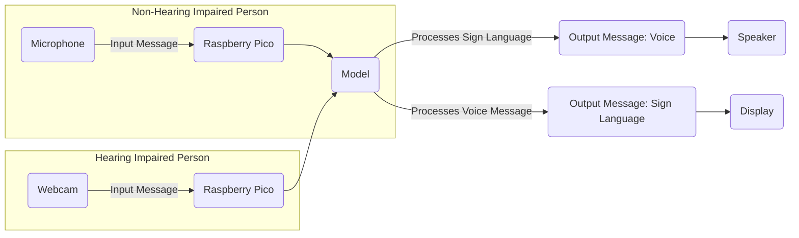

# BridgComm: A Video Intercom for the Deaf 🧏

## Project Overview 💼

**BridgComm** is a communication system designed to facilitate interaction between hearing and non-hearing impaired individuals. The system captures sign language gestures from the hearing impaired person and converts them into voice messages. Conversely, it also captures voice messages from the non-hearing impaired person and translates them into sign language gestures for display.

### Key Features ✨
- **Sign Language Recognition**: Interprets sign language gestures using a webcam.
- **Text-to-Speech (TTS)**: Converts recognized sign language into audible voice messages.
- **Speech-to-Sign Language (STS)**: Converts voice messages into sign language gestures.

## System Components 📦

### Hardware 🪙
- **Raspberry Pico**: A microcontroller board for embedded applications.
- **Camera Module**: Captures video input for sign language recognition.
- **Microphone**: Captures voice input for processing.
- **Speaker**: Outputs the generated voice message.
- **Display**: Shows the generated sign language gestures.

### Software 🧑‍💻
- **Operating System**: FreeRTOS for real-time task management.
- **Programming Languages**: Python or C/C++ for developing the core application.
- **Libraries**: 
  - `OpenCV`: For image and video processing.
  - `TensorFlow` : For machine learning and sign language recognition.
  - `FFmpeg`: For multimedia processing.

### Connectivity 🤝
- **Network**: Optional Wi-Fi or cellular connectivity for remote communication.

### Power Supply ⚡
- Ensure the system is powered adequately, either via batteries or an external power source.

## System Workflow ⚒️



## Getting Started 🚀

### Prerequisites
- A Raspberry Pico board with necessary peripherals.
- Python or C/C++ installed on your development environment.
- Required libraries (OpenCV, TensorFlow/PyTorch, FFmpeg).

### Installation 📩
1. Clone the repository:
    ```bash
    git clone https://github.com/nithamitabh/BridgComm.git
    cd BridgComm
    ```
2. Install dependencies:
    ```bash
    pip install -r requirements.txt
    ```

### Running the Project 💨
1. Connect the hardware components according to the Raspberry Pico's pinout.
2. Run the Python notebooks or C/C++ files for testing individual components.
3. Integrate the components into the central model.

## Dataset 🗃️
The project uses an Indian Sign Language (ISL) dataset from Kaggle for training and testing the sign language recognition model.

## Future Work 🧑‍🏭
- Implement a more robust sign language recognition model.
- Improve the accuracy and speed of the TTS and STS modules.
- Expand project to support multiple languages and dialects.
### Model
https://jupyter.org/try-jupyter/notebooks/?path=BridgComm_Model.ipynb

## Contributing 🎮
Contributions are welcome! Please feel free to submit a pull request or open an issue for discussion.

## License 📃
This project is licensed under the MIT License.
